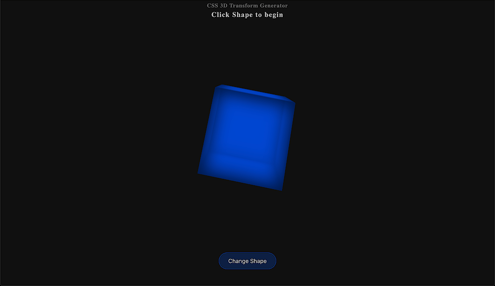
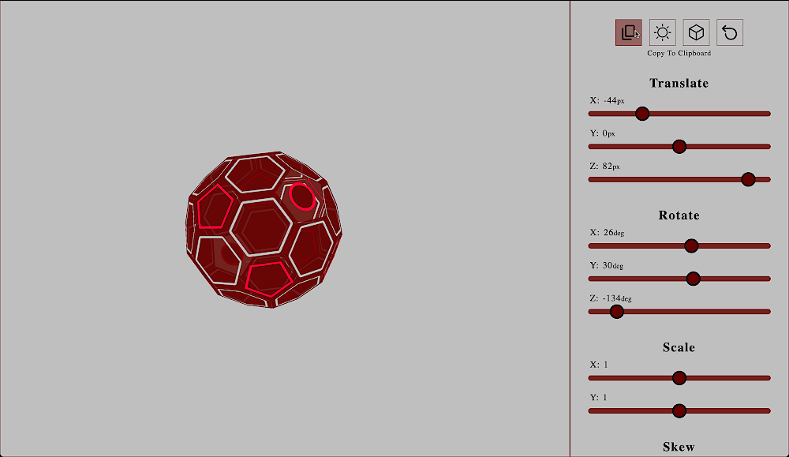

# CSS-3D-Transform-Generator
> Generate: Translate, Rotate, Scale, Skew

See live generator [here](https://itsvalle.com/projects/Proj03/index.html)

## Table of Contents
- [General Info](#general-information)
- [Features](#features)
- [Screenshots](#screenshots)
- [Usage](#usage)
- [Contact](#contact)

## General Information
- Generate CSS for 3D space
- Copy CSS to clipboard
- Includes vendor prefixes

## Features
- Light and dark theme
- Undo button
- Multiple Shapes

## Screenshots

## Usage
Range input sliders are used for manipulating shapes

 copies css to clipboard

 toggles theme

 cycles through shapes

 resets transforms

## Contact
Created by [@valle572](https://itsvalle.com) - feel free to contact me :)
